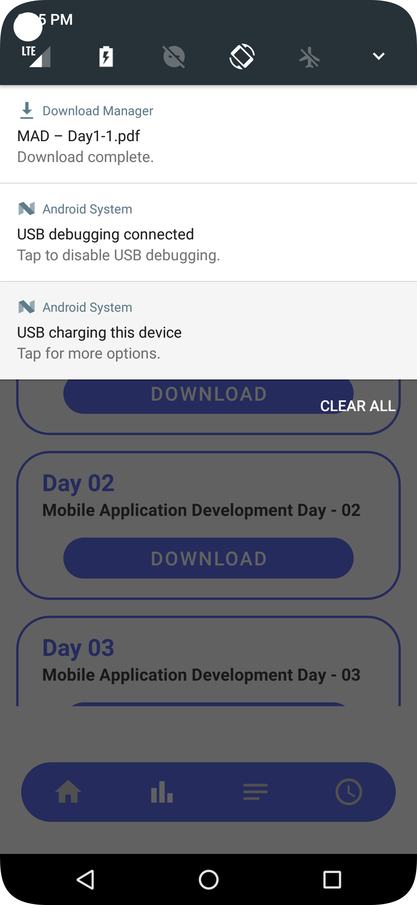

# StudyStream LMS MobileApp

<b>Sample Preview Of the Mobile Application

 
 

<video src="Video/StudyStreamNew.mp4" width="260" height="510"/>

 
 

<b>Sample Screenshots Of the Mobile Application

 
 
  

